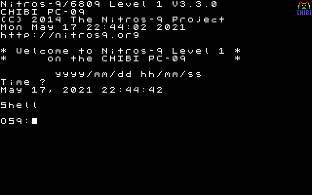

# chibi pc-09
 

## This document is no longer accurate and will be updated in the future.

## Description:
The pc-09 will be an extremely expandable Motorola 6809 based microcomputer that can run OS-9 of off an SD card:

- On boot, the coldboot ROM will search an SD card for a bootfile, load it into RAM, and execute it. The bootfile will be a BIN file that is copied directly to RAM. This bootfile can be copied and moved the same as any other file, allowing for easy backup and distribution of boot code. 

- It will come with 64k of RAM by default. These are split into 2k RAM blocks. The first page is the Kernal Root Block. The second-to-last page is the I/O Block. The last page is the Vector Block. All other blocks are normal RAM. A maximum of 58k of address space is program-accessible, without an MMU. 

- The 6829 MMU creates 4 different address spaces, with the kernal occupying address space 0. With the MMU, only the kernal process will need the I/O and Kernal Root Blocks. Multiple MMUs can be combined to create up to 32 address spaces. The MMU has a 10-bit output, but the maximum amount of addressable RAM will be 1mb, as the upper address line is used for marking r/rw, as outlined in the 6829 datasheet.

- The I/O Block is sub-divided into 128 devices, with 16 addresses each. Address 0 will be a descriptor, so that the coldboot ROM can address it with a defined protocol.

- The graphics system will be more advanced than most homebrew computer projects. It will have a custom TTL logic graphics card that will be able to display 320x200 in 256 colours over VGA. There will be 64k of double-buffered VRAM, interfaced via commands. The buffer will not copy unless a 'done' command is sent. This way, if the frame is not ready, the previous frame will be displayed, preventing tearing. These commands will include an auto-increment function, allowing entire bitmaps to be copied with ease. It will also have a text mode, utilizing bitmap copy from the character ROM. [SUBJECT TO CHANGE]

- It will run OS-9, with pc-09 specific drivers and memory management. This should be invisible to OS-9 programs that use only system calls.

## Progress

Currently there isn't a lot to see here. I am in the process of getting everything from my head onto paper.
